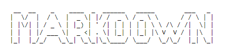

# HEADING

## HEADING

### HEADING

#### HEADING

##### HEADING

---

STANDARD TEXT

**BOLD TEXT**

_ITALIC TEXT_

~~MIDDLE LINED TEXT~~

---

1. ORDERED LIST
   1. ORDERED LIST
2. ORDERED LIST
3. ORDERED LIST

---

EFFICENT WAY TO USE LIST

1. ORDERED LIST
   1. ORDERED LIST
1. ORDERED LIST
1. ORDERED LIST

---

- UNORDERED LIST
- UNORDERED LIST
- UNORDERED LIST

---

INLINE CODE BLOCK `INLINE CODE BLOCK`

```dart
//Programming Language

String text = "Sample Text"
int number = "MULTIN LINE CODE BLOCK"

```

---

## BLOCK QUOTE

> BLOCK QUOTE BLOCK QUOTE BLOCK QUOTE BLOCK QUOTE BLOCK QUOTE BLOCK QUOTE BLOCK QUOTE BLOCK QUOTE BLOCK QUOTE BLOCK QUOTE BLOCK QUOTE BLOCK QUOTE BLOCK QUOTE BLOCK QUOTE BLOCK QUOTE BLOCK QUOTE BLOCK QUOTE BLOCK QUOTE BLOCK QUOTE BLOCK

---

## INTERNAL LINK

[LINK SHOW NAME](#LINK-URL)

[HEADING - 2](#heading-2)

---

## EXTERNAL LINK

[GOOGLE](https://www.google.com)

---

## CHECKBOX

[ ] TASK 1

[x] TASK 2

---

## TABLE

### HEADER ALTINDAKİ SAĞA ORTAYA VE SOLA YASLAMA

| TABLE HEADER | TABLE HEADER | TABLE HEADER |
| :----------- | :----------: | -----------: |
| VALUE        |    VALUE     |        VALUE |
| VALUE        |    VALUE     |        VALUE |
| VALUE        |    VALUE     |        VALUE |

---

<details>
    <summary>Section A</summary>

    Lorem ipsum Lorem ipsumLorem ipsumLorem ipsumLorem ipsumLorem ipsumLorem ipsumLorem ipsumLorem ipsumLorem ipsumLorem ipsumLorem ipsumLorem ipsumLorem ipsumLorem ipsumLorem ipsumLorem ipsumLorem ipsumLorem ipsumLorem ipsumLorem ipsumLorem ipsumLorem ipsumLorem ipsumLorem ipsumLorem ipsumLorem ipsumLorem ipsumLorem ipsumLorem ipsumLorem ipsumLorem ipsumLorem ipsumLorem ipsumLorem ipsumLorem ipsum

</details>

---

## IMAGES




---
